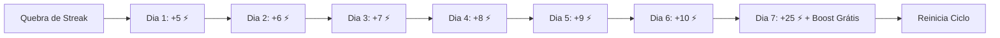
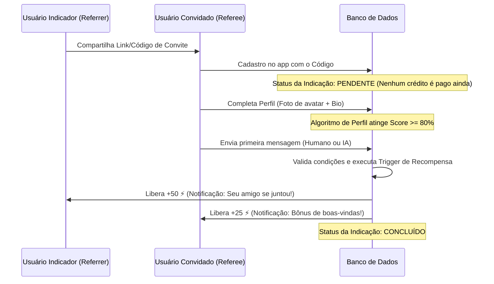

# 🪙 Monetização, Economia e Gamificação - Desvio

Este documento estabelece as especificações de negócio e arquitetura técnica para o sistema de monetização, economia de créditos virtuais e loops de gamificação (recompensas diárias e indicações) da plataforma **Desvio**.

---

## 1. Visão Geral da Economia

O **Desvio** adota um modelo **Híbrido de Assinatura VIP (SaaS) e Microtransações (Créditos Virtuais)**. A economia é projetada para equilibrar o custo operacional das APIs de Inteligência Artificial e SMS com o engajamento dos usuários, utilizando o gatilho psicológico de escassez e recompensa.

### Moeda Virtual: *Desvio Credits (⚡)*
- **Como obter**: Compras in-app, check-in diário (retenção) e indicações de novos usuários (crescimento viral).
- **Como gastar**: Chats com IAs de liquidez, impulsos de visibilidade (Radar Boosts), revelação de curtidas e desbloqueios de galerias privadas.

---

## 2. Loops de Gamificação e Crescimento

Para fomentar o uso contínuo e a aquisição de baixo custo, implementaremos dois motores de recompensas baseados em créditos.

### A. Loop de Retenção: Check-in Diário Progressivo (Daily Streak)
Para incentivar o usuário a abrir o app todos os dias, a recompensa de créditos aumenta progressivamente a cada dia consecutivo de login.



- **Regra de Negócio**:
  - O dia do usuário vira às 00:00 no fuso horário local.
  - Se o usuário ficar mais de 36 horas sem fazer check-in, a sequência (*streak*) é zerada e retorna ao **Dia 1**.
  - O **Dia 7 (Milestone)** concede um bônus especial de +25 ⚡ e 1 cupom de *Radar Boost* de 30 minutos.

### B. Loop de Crescimento Viral: Sistema de Indicações Inteligente (Referral)
Para evitar fraudes comuns (criação em massa de contas falsas apenas para farmar créditos), o sistema de recomendação adota um **gatilho de validação de perfil**.



- **Gatilhos Anti-Fraude (Condições de Validação)**:
  1. O convidado deve fazer o upload de pelo menos 1 foto real (avatar cadastrado).
  2. O `profile_score` (completude de perfil) do convidado deve ser igual ou superior a **80%**.
  3. O convidado deve interagir no app (enviar ao menos 1 mensagem no chat).
  4. O IP do convidado e do indicador devem ser validados como diferentes.

---

## 3. Matriz de Consumo da Economia (Free vs. Premium com Franquia)

Para garantir a saúde financeira da plataforma (visto que APIs de IA e envios de SMS via Twilio geram custos reais e variáveis), o plano premium não adota a premissa de "recursos 100% ilimitados". Em vez disso, estabelecemos **limites muito maiores** (franquia ampliada de alta capacidade), protegendo a margem de lucro operacional contra abusos e bots.

### Franquia e Consumo de Créditos (⚡)

| Funcionalidade | Custo Avulso (Plano Free) | Limites no Plano Free | Limites no Plano Assinatura Premium |
| :--- | :--- | :--- | :--- |
| **Chat com IAs de Liquidez** | **1 ⚡ por mensagem** | Ganha 10 mensagens de teste no onboarding. Depois consome saldo. | **Franquia de 500 mensagens/mês inclusas** *(excedente consome créditos normais)* |
| **Radar Boost (30 min)** | **15 ⚡ por boost** | Apenas comprando com créditos ganhos ou adquiridos. | **5 Boosts gratuitos inclusos por mês** *(excedente custa 15 ⚡)* |
| **Revelar Likes ("Quem me curtiu")**| **10 ⚡ por perfil revelado** | Fotos borradas no feed de curtidas. | **Revelação gratuita de até 15 perfis/dia** *(excedente custa 10 ⚡)* |
| **Galerias de Mídia Privada** | **20 ⚡ por desbloqueio** | Validade de visualização expira após 15 dias. | **Visualização permanente** para todos os matches ativos. |
| **Encontro Seguro (Safety Timer)** | **Grátis (Básico)** | Permite cadastrar **1 contato** de emergência. SMS padrão. | **Permite até 5 contatos**, rastreamento ativo em tempo real e prioridade de entrega. |
| **Filtros Avançados no Radar** | **Indisponível** | Busca restrita (idade, gênero, distância básica). | **Acesso total aos filtros** de estilo de vida, tags e compatibilidade da Resonance Engine. |

---

## 4. Tabela de Preços, Pacotes e Nome do Plano VIP

### A. Venda de Créditos Avulsos (Plano Free)
Perfeito para usuários casuais que preferem um modelo pague-pelo-que-usar (*Pay-as-you-go*), sem compromisso mensal.

*   **Pacote Inicial (Lite Core)**: 50 ⚡ por **R$ 9,90** *(R$ 0,19 por crédito)*
*   **Pacote Recomendado (Cyber Engine)**: 200 ⚡ por **R$ 29,90** *(R$ 0,14 por crédito) - Melhor Custo-Benefício*
*   **Pacote Dossier Max (Absolute)**: 500 ⚡ por **R$ 59,90** *(R$ 0,11 por crédito)*

### B. Sugestões de Nomes para o Plano de Assinatura
Alinhados ao tom "Cyber-Premium Glassmorphic" e de "Dossiê Seguro" do Desvio, propomos as seguintes identidades para o plano recorrente:

1.  **Protocolo Bypass (O Favorito)**: Dá a sensação de burlar barreiras técnicas e obter privilégios de alto desempenho na rede.
2.  **Spectrum Access**: Remete à exclusividade de luz, mistério e frequências especiais de conexão.
3.  **Desvio Absolute**: Um nome minimalista que evoca status definitivo e elite.
4.  **Stealth Pass**: Conexão segura e misteriosa de altíssima segurança.

### C. Assinatura VIP Recorrente (Mensalidade Fixa)
*   **Valor Mensal**: **R$ 34,90/mês**
*   **Valor Semestral**: **R$ 149,40** (Equivalente a **R$ 24,90/mês** - *28% de desconto*)
*   **Estética Exclusiva**: Emblema estético neon (*Cyber Verified Aura*) brilhando em roxo ao redor da foto de perfil no Radar.


---

## 5. Modelagem do Banco de Dados (Supabase / Postgres)

Para suportar essa infraestrutura de maneira segura e transacional, propomos a criação e extensão das seguintes tabelas:

### A. Tabela de Saldos (`user_balances`)
Armazena o saldo consolidado atual de créditos dos usuários.

```sql
CREATE TABLE public.user_balances (
    user_id UUID PRIMARY KEY REFERENCES auth.users(id) ON DELETE CASCADE,
    credits INT NOT NULL DEFAULT 10 CHECK (credits >= 0), -- 10 créditos de boas-vindas padrão
    daily_streak INT NOT NULL DEFAULT 0,
    last_check_in TIMESTAMPTZ,
    created_at TIMESTAMPTZ DEFAULT NOW(),
    updated_at TIMESTAMPTZ DEFAULT NOW()
);

-- Ativar Row Level Security (RLS)
ALTER TABLE public.user_balances ENABLE ROW LEVEL SECURITY;

-- Apenas leitura pelo próprio usuário. Atualizações feitas estritamente via funções RPC no servidor.
CREATE POLICY "Users can view their own balance" 
    ON public.user_balances FOR SELECT 
    USING (auth.uid() = user_id);
```

### B. Histórico de Transações de Crédito (`credit_transactions`)
Audita todas as entradas e saídas de créditos para evitar fraudes e garantir rastreabilidade.

```sql
CREATE TYPE transaction_type AS ENUM ('daily_check_in', 'referral_reward', 'purchase', 'ai_chat', 'radar_boost', 'reveal_like', 'unlock_gallery');

CREATE TABLE public.credit_transactions (
    id UUID PRIMARY KEY DEFAULT gen_random_uuid(),
    user_id UUID NOT NULL REFERENCES auth.users(id) ON DELETE CASCADE,
    amount INT NOT NULL, -- Valores positivos para ganho, negativos para consumo
    type transaction_type NOT NULL,
    metadata JSONB DEFAULT '{}'::jsonb, -- Ex: { referee_id: "uuid" } ou { message_id: "uuid" }
    created_at TIMESTAMPTZ DEFAULT NOW()
);

-- Ativar RLS
ALTER TABLE public.credit_transactions ENABLE ROW LEVEL SECURITY;

CREATE POLICY "Users can view their own transactions" 
    ON public.credit_transactions FOR SELECT 
    USING (auth.uid() = user_id);
```

### C. Tabela de Indicações (`referrals`)
Rastreia o ciclo de vida do convite de usuários.

```sql
CREATE TYPE referral_status AS ENUM ('pending', 'completed', 'failed');

CREATE TABLE public.referrals (
    id UUID PRIMARY KEY DEFAULT gen_random_uuid(),
    referrer_id UUID NOT NULL REFERENCES auth.users(id) ON DELETE CASCADE, -- Quem indicou
    referee_id UUID UNIQUE NOT NULL REFERENCES auth.users(id) ON DELETE CASCADE, -- O convidado
    status referral_status NOT NULL DEFAULT 'pending',
    rewarded BOOLEAN NOT NULL DEFAULT FALSE,
    created_at TIMESTAMPTZ DEFAULT NOW(),
    updated_at TIMESTAMPTZ DEFAULT NOW()
);

-- Ativar RLS
ALTER TABLE public.referrals ENABLE ROW LEVEL SECURITY;

CREATE POLICY "Users can view referrals they initiated" 
    ON public.referrals FOR SELECT 
    USING (auth.uid() = referrer_id);
```

---

## 6. Lógica Serverless / Triggers para Automação

### Função de Execução de Transação Segura
Toda alteração de saldo deve ser feita através de uma transação bancária protegida, garantindo que o saldo nunca fique negativo e gravando a auditoria.

```sql
CREATE OR REPLACE FUNCTION public.execute_credit_transaction(
    p_user_id UUID,
    p_amount INT,
    p_type transaction_type,
    p_metadata JSONB DEFAULT '{}'::jsonb
) RETURNS INT AS $$
DECLARE
    v_current_balance INT;
BEGIN
    -- Obter e travar a linha de saldo para evitar condições de corrida (Race Conditions)
    INSERT INTO public.user_balances (user_id, credits)
    VALUES (p_user_id, 10)
    ON CONFLICT (user_id) DO UPDATE SET updated_at = NOW()
    RETURNING credits INTO v_current_balance;

    -- Validar se há saldo suficiente para transações de débito
    IF p_amount < 0 AND (v_current_balance + p_amount) < 0 THEN
        RAISE EXCEPTION 'Saldo de créditos insuficiente. Saldo atual: %, Requerido: %', v_current_balance, ABS(p_amount);
    END IF;

    -- Atualizar o saldo
    UPDATE public.user_balances
    SET credits = credits + p_amount,
        updated_at = NOW()
    WHERE user_id = p_user_id;

    -- Registrar no log de transações
    INSERT INTO public.credit_transactions (user_id, amount, type, metadata)
    WHERE user_id = p_user_id; -- (Corrigido na versão final do trigger no código)

    INSERT INTO public.credit_transactions (user_id, amount, type, metadata)
    VALUES (p_user_id, p_amount, p_type, p_metadata);

    RETURN (v_current_balance + p_amount);
END;
$$ LANGUAGE plpgsql SECURITY DEFINER;
```

---

## 7. Próximos Passos de Implementação (Roadmap)

### Fase 1: Fundação do Banco de Dados
- Executar scripts de migração das tabelas (`user_balances`, `credit_transactions`, `referrals`).
- Validar as políticas RLS para garantir que nenhum usuário consiga atualizar diretamente seu saldo através de injeção de requisições client-side.

### Fase 2: Backend & Triggers
- Implementar a rota/RPC de check-in diário (`claim_daily_bonus`) calculando dinamicamente a data do último check-in para manter ou resetar a sequência (*streak*).
- Implementar trigger em `public.users` ou tabela correspondente para monitorar alterações de perfil (quando `profile_score` atinge >= 80% e avatar está presente), disparando a função de conversão de convite.

### Fase 3: UI/UX Glassmorphic
- Desenvolver tela de "Carteira Cyber" contendo visualizador de saldo de créditos neon, pacotes de recarga, e contador de streak do check-in diário.
- Criar fluxo animado de ganho de moedas ("*Credit Dispatched Successfully*") com micro-animações de partículas roxas.

---
*Documentação de Monetização do Desvio - Versão 1.0 (2026-05-17)*
